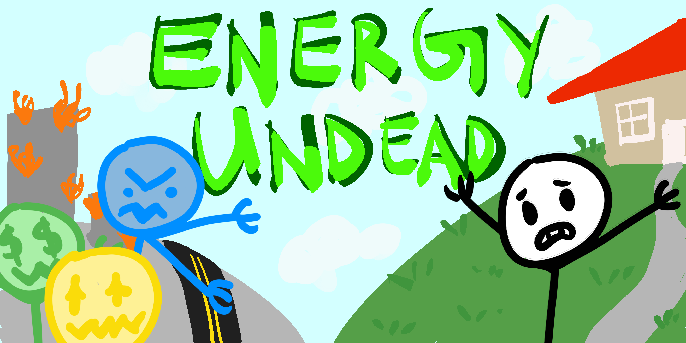

# Energy-Undead
By: *Daniel Philipov, Katie Merrill, Bradley Cao, Mina Warner*

   

## Inspiration
We were inspired by the ongoing global climate crisis, but in particular, we feel that many people become overwhelmed when thinking about climate change and are unsure about what they can actually do to help. However, there are many ways to improve your home’s environmental footprint, from small lifestyle changes to entire home renovations. For example, adding triple paned windows greatly helps with insulation, but simply being conscious of your energy usage when it comes to appliances contributes to overall changes. Through the use of a video game, we hope to appeal to young audiences and to offer suggestions for how to be more eco-friendly.

## What it does
Energy Undead is a game that incorporates real-world energy saving techniques into the world of a playful zombie apocalypse. The game features three original species of zombies: Chillys which represent wasteful heating, Zappies which feast on excess electricity and Blingies who love to munch on any spare cash they can get their hands on. These colorful characters are metaphors for the many issues a home might face when trying to be more eco-friendly. In order to thwart the zombies, the player, a newly graduated environmental scientist, must upgrade their neighbors home to prevent them from invading. These upgrades come in the form of three simple minigames: adding additional panes to windows, filling in insulation and setting the thermostat just right. When all of these tasks are completed, the player will reign victorious and defeat the malicious zombie horde.

## How we built it
We built Energy Undead using the Unity game engine, which involved writing scripts in C# and interacting with Unity-specific functions such as animators. We had to consult many forums and tutorials to figure out how to make things. Mina drew the assets/art for the game using an apple pencil and tablet running procreate, adopting a comic book style suited towards children. We built the app for a website using WebGL.

## Challenges we ran into
Bradley was the only team member who had significant experience with Unity, and even he was a little rusty, so all of us ran into troubles ranging from syntax to logic issues with the game engine. Despite our lack of knowledge, we actually had very few major challenges, instead facing many small issues in different parts of the project. For example, we had to recreate some of the sprites (characters/objects) many times because of incorrect assumptions about what information they contain. Detecting when the player’s character intersected with an object was particularly difficult because of Unity-specific methods that were not intuitive. Additionally, sharing our code on GitHub led to several merge conflicts.

## Accomplishments that we're proud of
Our entire project was a learning experience, so we’re proud of the whole game. Even a walking stick-figure took a couple hours to perfect, and many aspects that seemed to be simple took much longer than expected. However, we are very proud to have a cohesive product that incorporates everything we wanted to include, and we think it turned out even better than we had hoped!

## What we learned
As mentioned, most of us had limited or no experience using game development tools like Unity, so we learned to adapt the skills we already had from our classes at school to a vastly different environment like Unity. Many of the skills that we were able to adapt were about researching, debugging, and reverse-engineering semi-related projects, because most of the content itself was new. We learned not only about specific methods and functions of Unity, but also about the game development process, as we could have avoided many complications if we had known what path to take and what to create first.

## What's next for Energy Undead
We hope to create more minigames that are higher quality and showcase more ways to reduce a home’s environmental impact. In particular, we would focus on simple actions that could be taken by anyone looking to improve their home, without high cost or commitment.
